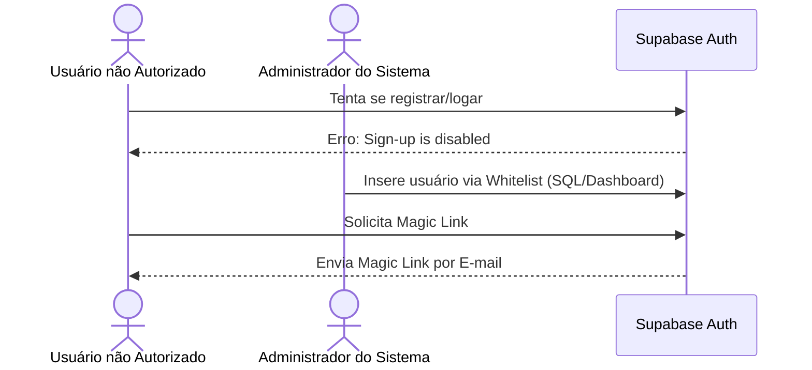

# Gerenciamento de Acesso e Autenticação (Supabase)

Esta seção documenta a política de controle de acesso ao **Salgado Finance App** e estratégias de suporte de autenticação para dispositivos móveis iOS.

---

## 1. Segurança e Controle de Acesso (Whitelist)

Como o FinanceApp é um sistema de finanças pessoais de uso restrito, as inscrições abertas ao público estão **desativadas**. Apenas usuários previamente autorizados (na whitelist) podem realizar o login.

### A. Desativação do Sign-Up Público
Para evitar cadastros indesejados:
1. No painel do Supabase, acesse **Auth** > **Providers** > **Email**.
2. Desative a opção **"Allow Public Sign Up"**.
3. Salve as alterações.



### B. Inserção Manual de Usuários
Para autorizar um novo e-mail a acessar a aplicação, insira o usuário manualmente pelo painel do Supabase (seção **Auth** > **Users** > **Add User** > **Create User**) ou execute o comando SQL direto no Editor de SQL do Supabase:

```sql
-- Insere um novo usuário diretamente na tabela auth.users com e-mail confirmado
INSERT INTO auth.users (
  instance_id, id, aud, role, email, 
  encrypted_password, email_confirmed_at, 
  recovery_sent_at, last_sign_in_at, 
  raw_app_meta_data, raw_user_meta_data, 
  created_at, updated_at, confirmation_token, 
  email_change, email_change_token_new, 
  recovery_token
) VALUES (
  '00000000-0000-0000-0000-000000000000',
  gen_random_uuid(),
  'authenticated',
  'authenticated',
  'usuario@exemplo.com.br',
  crypt('uma-senha-temporaria-forte', gen_salt('bf')),
  NOW(),
  NULL,
  NULL,
  '{"provider":"email","providers":["email"]}',
  '{}',
  NOW(),
  NOW(),
  '',
  '',
  '',
  ''
);
```

---

## 2. Troubleshooting para iOS/Safari (PWA)

### A. A Limitação do iOS / Magic Link
Ao utilizar a aplicação instalada no iPhone como um **Web App (PWA)** na tela de início, surge um comportamento de segurança do sistema operacional iOS:
* Ao clicar no link do Magic Link recebido no e-mail (ex: Outlook, Gmail, Mail App), o iOS abre o link **obrigatoriamente no navegador padrão** (Safari ou Chrome convencional).
* Como o estado de sessão de cookies/localStorage do Safari convencional é **isolado** da sandbox da tela de início do PWA, o Web App instalado na tela de início permanece **deslogado**, impedindo o login fluido.

### B. Solução: Login Manual via Link (Bypass Secreto)
Para contornar o isolamento de sandbox do iOS, implementamos um mecanismo secreto de injeção direta de tokens de autenticação:

#### Passo a Passo para o Usuário no iPhone:
1. Abra o aplicativo instalado na tela de início (**PWA**).
2. Na tela de login, clique **5 vezes seguidas** na logo ou no título **"FinanceApp"**.
3. Uma seção oculta intitulada **"Entrar Manualmente via Link"** aparecerá na parte inferior da tela.
4. Digite o seu endereço de e-mail no campo padrão da parte superior.
5. Acesse seu aplicativo de e-mail, **copie o link de verificação** enviado pelo Supabase (ou o endereço final para onde ele te redirecionou) e **cole-o** no campo de texto da seção secreta.
6. Clique em **"Entrar com o Link"**.
7. O aplicativo processará a validação do OTP ou os tokens de autenticação via API e estabelecerá a sessão de login diretamente dentro da sandbox do PWA, redirecionando-o para o `/dashboard`.

#### Exemplo de link aceito pelo campo secreto:
* **Link de verificação (Direto do e-mail):**
  `https://aoszuzhweogqpfveitji.supabase.co/auth/v1/verify?token=dd5f7b06fef22621c3027a256b310e75a15c211c3af8d04627604d42&type=magiclink&redirect_to=https://salgado-finance-app.com.br/login`
* **Link de redirecionamento final (Contendo hash de sessão):**
  `https://salgado-finance-app.com.br/login#access_token=ey...&refresh_token=...`
