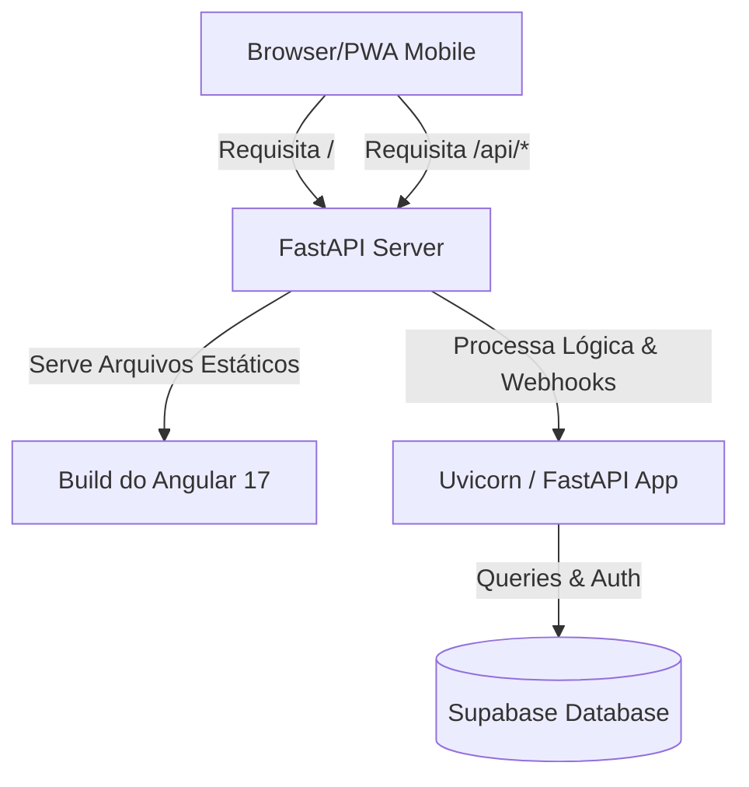

# Deploy na Render (Arquitetura Monolítica)

Esta seção documenta a arquitetura de produção do **Salgado Finance App** e como ele é implantado de forma unificada (monolito) na plataforma **Render**.

## 1. Arquitetura do Container

Para reduzir custos de hospedagem e simplificar o roteamento (evitando configurações complexas de CORS), optamos por uma **arquitetura de container monolítica**. 

O backend em FastAPI atua tanto como a API REST (`/api/*`) quanto como o servidor de arquivos estáticos para o frontend compilado em Angular 17.



---

## 2. Dockerfile Multi-Estágio

A implantação na Render é baseada no arquivo [Dockerfile](file:///workspaces/finance-app/Dockerfile) localizado na raiz do projeto. Ele utiliza duas etapas de compilação:

### Estágio 1: Build do Frontend (Angular 17)
Usa o container de Node.js para instalar as dependências e gerar os arquivos estáticos de produção na pasta `dist/finance-app/browser`.
```dockerfile
FROM node:20-alpine AS frontend-builder
WORKDIR /app/frontend
COPY frontend/package*.json ./
RUN npm ci
COPY frontend/ ./
RUN npm run build && \
    if [ ! -d "dist/finance-app/browser" ]; then \
      mkdir -p dist/finance-app/browser_temp && \
      mv dist/finance-app/* dist/finance-app/browser_temp/ || true && \
      mv dist/finance-app/browser_temp dist/finance-app/browser; \
    fi
```

### Estágio 2: Runner Final (FastAPI + Uvicorn)
Instala as dependências do Python, copia os arquivos do backend e transfere os ativos estáticos gerados no Estágio 1 diretamente para o diretório `/app/backend/static`.
```dockerfile
FROM python:3.11-slim AS final-runner
WORKDIR /app
ENV PYTHONDONTWRITEBYTECODE=1
ENV PYTHONUNBUFFERED=1
COPY backend/requirements.txt ./backend/
RUN pip install --no-cache-dir -r backend/requirements.txt
COPY backend/ ./backend/
RUN mkdir -p /app/backend/static
COPY --from=frontend-builder /app/frontend/dist/finance-app/browser/ /app/backend/static/
ENV PYTHONPATH=/app/backend
WORKDIR /app/backend
EXPOSE 10000
CMD ["sh", "-c", "uvicorn main:app --host 0.0.0.0 --port ${PORT:-10000}"]
```

---

## 3. Configurações no Painel da Render

Ao criar o serviço na Render, selecione a opção **Web Service** e aponte para o repositório do GitHub.

### Configurações Básicas:
| Propriedade | Valor |
| :--- | :--- |
| **Runtime** | `Docker` |
| **Instance Type** | `Free` (ou superior) |
| **Branch** | `main` |

### Variáveis de Ambiente (Environment Variables):

Abaixo estão as variáveis de ambiente necessárias para o correto funcionamento do ecossistema:

| Variável | Descrição | Exemplo em Produção |
| :--- | :--- | :--- |
| `PORT` | Definido automaticamente pela Render (geralmente `10000`) | `10000` |
| `SUPABASE_URL` | URL de conexão do projeto Supabase | `https://your-project.supabase.co` |
| `SUPABASE_KEY` | Chave de API de Serviço (Service Role) do Supabase | `eyJhbGciOi...` |
| `PLUGGY_CLIENT_ID` | ID de Cliente para integração Open Finance com a Pluggy | `73d09...` |
| `PLUGGY_CLIENT_SECRET` | Segredo de Cliente da Pluggy | `sec_...` |

> [!IMPORTANT]
> A chave `SUPABASE_KEY` configurada no backend deve ter privilégios suficientes para contornar ou executar ações de RLS conforme as regras de negócio de integração de transações e webhooks.
